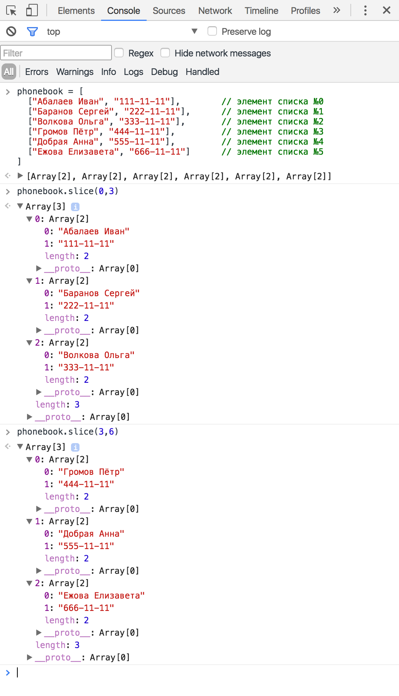
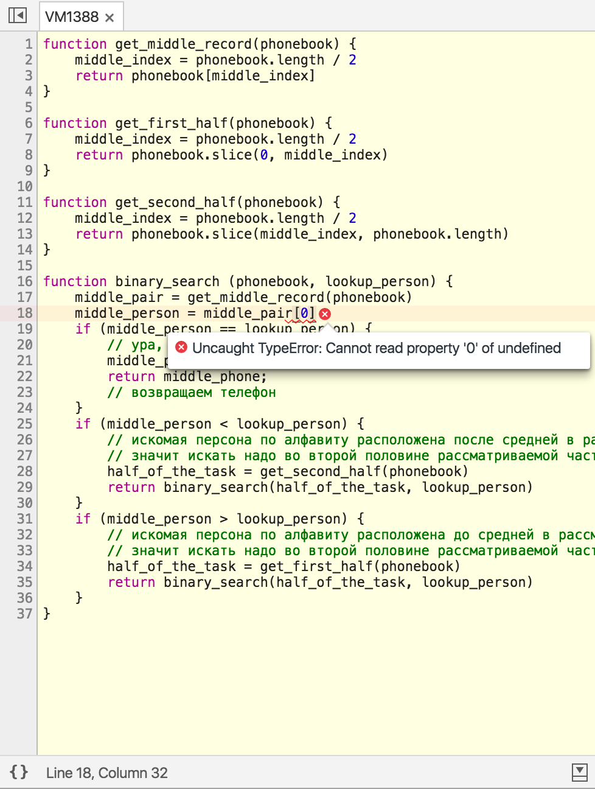
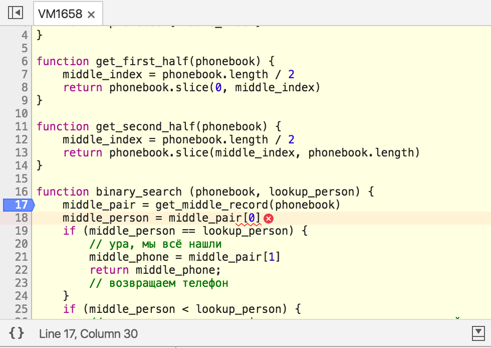
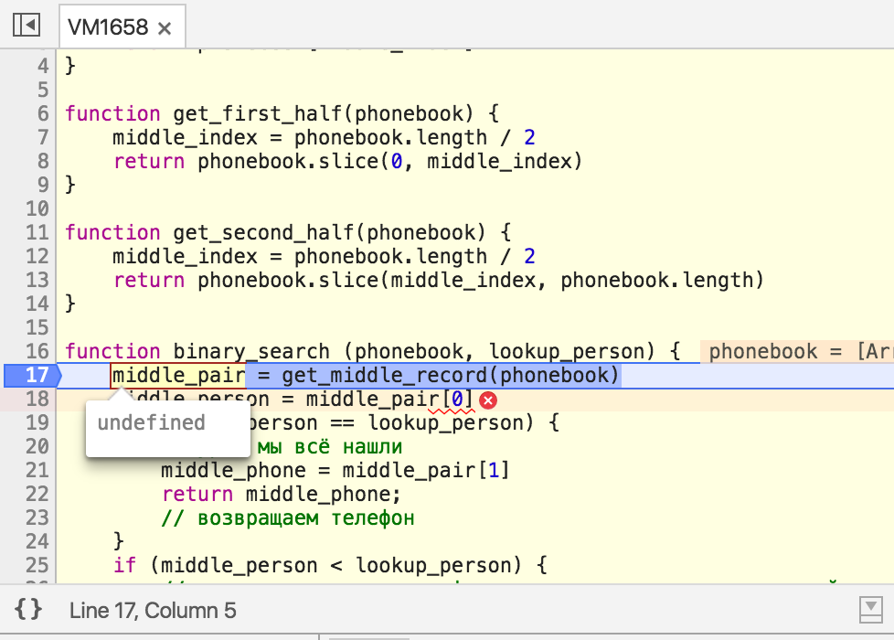
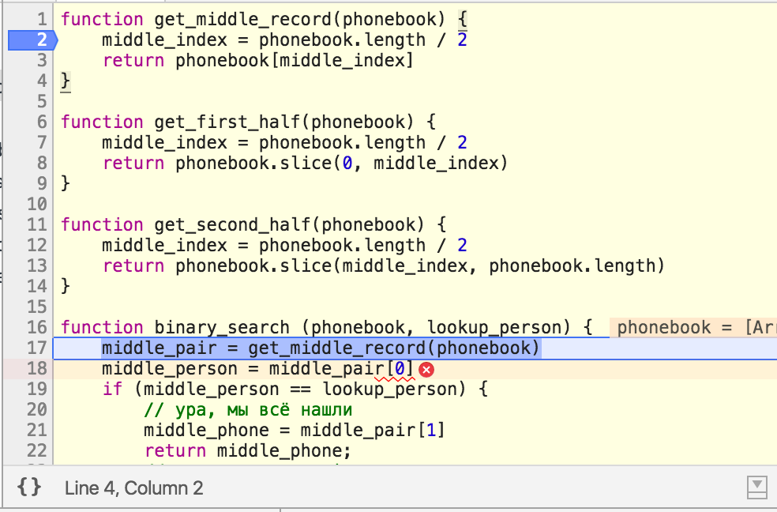
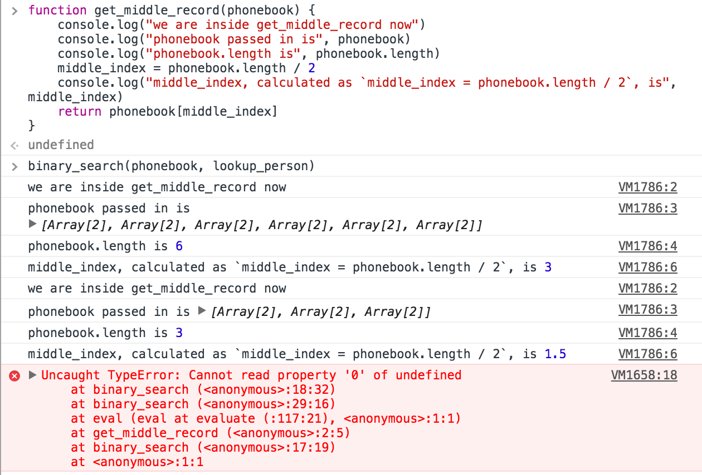
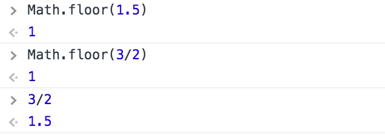

# Размер задач. Двоичный поиск.

## Вступление

В первый день мы посмотрели [вводную лекцию CS50](https://www.youtube.com/watch?v=SW_UCzFO7X0). Помимо моря завлекушечек и внезапных технознаменитостей, в ней затрагивалось две важных темы: кодирование данных и размер задач.

С кодированием данных мы рассмотрели позиционные системы счисления, и в частности двоичную систему счисления. На этот счёт повторяться не будем ;)

## Двоичный поиск

### Описание задачи

А вот про размер задач сейчас поговорим. В лекции была рассмотрена задача поиска телефона по фамилии и имени человека в телефонном справочнике. Справочник — большая книжка, содержащая пары “фамилия имя — телефон”, отсортированные алфавитно по фамилиям. Справочник может быть большим или маленьким, и отличие будет в количестве пар “фамилия имя — телефон”. Может быть справочник на 100 телефонов, на 1000, на 2500, на 50000, на миллион — можно сказать, что телефонов в справочнике N штук. Это самое N и называют размером задачи. А сама задача формулируется так: “найти конкретный телефон по имеющимся имени и фамилии в справочнике на N пар “фамилия имя — телефон”, отсортированном алфавитно по фамилиям (и, в рамках одной и той же фамилии, по именам)”. Вот так вот — чуть громоздко, зато точно.

### Ключевая идея решения

Лектор курса CS50 задачу решил эффектно — буквально, разорвал сложность на части. Воспользовавшись тем, что телефонный справочник упорядочен, он обнаружил: искомая фамилия всегда находится либо в первой его половине, либо во второй, это можно сказать с уверенностью. Более того, можно с уверенностью сказать в какой именно: если искомая фамилия по алфавиту находится позднее, чем фамилия ровно посередине справочника — то во второй, иначе — в первой. Можно заметить, что мы сейчас сформулировали типичную операцию принятия решения (“если — то — иначе”, “if — then — else”) — это действительно так, в конструкциях любого императивного языка программирования мы бы её так и записали. А повторение действия для уменьшенной вдвое задачи — это вполне себе типичный цикл (или столь же типичная рекурсия, о чём ниже).

### Уменьшение сложности

Каждый раз, когда мы выбираем одну из половин справочника, мы уменьшаем сложность рассматриваемой задачи вдвое. Был справочник с N телефонов — а осталась его половина с N/2 телефонов. Остаётся только повторить процесс до тех пор, пока мы не найдём искомую запись. Конечно, вручную мы обычно ищем немного по-другому, комбинируя этот подход с последовательным просмотром, но для программирования двоичный поиск (а именно так называется этот подход) просто незаменим — и да, он ух как оптимален. Раз на каждом шаге мы уменьшаем сложность задачи вдвое, то будет верно и обратное: чтобы решить задачу вдвое большей сложности нам понадобиться добавить всего лишь одно действие! Правда-правда: поиск в справочнике на миллиард телефонов и поиск в справочнике на два миллиарда будут отличаться всего лишь единственным его открытием на середине!

### Псевдокод

#### Версия первая: код на русском языке

Можем записать небольшой псевдокод для нашей задачи, на русском языке:

Входные данные (что мы имеем изначально):
* список пар “фамилия, имя — телефон”, отсортированный по алфавиту (сначала фамилии, если фамилии совпадают — имена) — состоит из N пар. Говорят “длина списка равна N”, или, более общо, “размер задачи равен N”
* фамилия и имя искомого человека

Выходные данные (что мы хотим узнать):
* телефон искомого человека
* место в списке, где находится запись об искомом человеке и его телефоне

Метод решения:
1. Мы начинаем поиск, рассматривая список целиком — любой из N элементов может оказаться нашим искомым
2. Открываем справочник ровно посередине и сравниваем среднюю запись с искомой.
3. Если средняя фамилия справочника совпадает с искомой — ура, мы всё нашли. Закончить работу, вернуть обнаруженную пару.
4. Если средняя фамилия справочника по алфавиту идёт позднее искомой — вторую часть справочника мы отбрасываем (упрощаем задачу себе вдвое тем самым), а в первой повторяем поиск начиная с пункта (2) нашего алгоритма
5. Если же средняя фамилия справочника по алфавиту идёт раньше искомой, то отбрасываем уже первую часть справочника, а поиск с пункта (2) повторяем для второй.

Всё, алгоритм записан. Многословно, зато вполне понятно любому русскоговорящему человеку. Но давайте пойдём дальше и его формализуем: слов станет поменьше, математической записи — побольше, и это приблизит нас к программной реализации.

#### Версия вторая: формализуем запись

Входные данные:
* phonebook — массив пар (person, phone), где person — строка вида “Surname Name”, phone —  строка вида “555-55-55”. Порядок пар задан алфавитным порядком строк person. Каждая пара имеет свой номер, по которому можно к ней обратиться.
* lookup_person — строка, содержащая имя и фамилию искомой персоны

Пример входных данных:

```javascript
phonebook = [
  ["Абалаев Иван", "111-11-11"],        // элемент списка №0 
  ["Баранов Сергей", "222-11-11"],      // элемент списка №1
  ["Волкова Ольга", "333-11-11"],       // элемент списка №2
  ["Громов Пётр", "444-11-11"],         // элемент списка №3
  ["Добрая Анна", "555-11-11"],         // элемент списка №4
  ["Ежова Елизавета", "666-11-11"]      // элемент списка №5
]
```

Квадратными скобками мы группируем данные: строки в парах, и пары в список.
Кавычки нам нужны для обозначения строк.
Элементы в массиве традиционно нумеруются с нуля (для этого есть причины, но мы их пока касаться не будем — просто запомним).
Двойной косой чертой `//` мы помечаем комментарии "для себя" — они в принципе не нужны, но нам так понятнее будет

Можно обратиться к элементу в списке по его номеру:
* `phonebook[0]` даст нам в результате `["Абалаев Иван", "111-11-11"]`
* `phonebook[3]` — `["Громов Пётр", "444-11-11"]`
* `phonebook[-1]` или `phonebook[6]` — это ошибочные обращения, у нас нет элементов по таким номерам

Пускай мы ищем конкретную девушку (романтика, ну?):

```javascript
lookup_person = "Добрая Анна"
```

В рамках каждой пары "человек - телефон" мы можем обратиться как к строке с фамилией и именем, так и к строке с телефоном: опять же, по номеру (говорят *по индексу*):

* `["Громов Пётр", "444-11-11"][0]` даст нам `"Громов Пётр"`
* `["Громов Пётр", "444-11-11"][1]` — `"444-11-11"`
* `["Громов Пётр", "444-11-11"][-1]` или `["Громов Пётр", "444-11-11"][2]` — ошибочные обращения, у этой пары есть только индексы 0 и 1.

Можно совместить индексирование телефонной книги и индексирование телефонной пары:

* `phonebook[0][0]` — получится `"Абалаев Иван"`
* `phonebook[0][1]` - получится `"111-11-11"`
* `phonebook[10][1]` - ошибка обращения по индексу к телефонной книге
* `phonebook[1][5]` - ошибка обращения по индексу к паре (мы получим `["Баранов Сергей", "222-11-11"][5]`, и упадём на попытке взять индекс 5 от пары, где существуют только индексы 0 и 1)

Я специально заостряю внимание на возможных ошибках — чтобы вы не пугались их и могли их понять, когда столкнётесь с ними в реальности.

Теперь нам нужна операция сравнения строк. Будем использовать привычные математические символы "равно", "больше" и "меньше", но с одной поправкой: чтобы отличать проверку на равенство от присваивания, проверку на равенство будем записывать двумя символами: `"=="`, а не `=`.

Операции проверки возвращают нам либо `true` (истину), либо `false` (ложь). Например:

* `"Громов Пётр" == "Громов Пётр"` вернёт `true` — строки совпадают, проверяемое условие выполняется
* `"Громов Пётр" == "Добрая Ольга"` вернёт `false` — строки различаются, проверяемое условие не выполняется
* `"Громов Пётр" < "Добрая Ольга"` вернёт `true` — по алфавиту "Громов" идёт до "Добрая", условие выполняется
* `"Абалаев Иван" > "Добрая Ольга"` вернёт `false` — по алфавиту "Абалаев" идёт тоже до "Добрая", так что условие не выполняется

Можно совместить индексирование, проверки и нашу входную переменную `lookup_person` (которая, как вы помните, имеет в нашем примере значение `"Добрая Анна"`):

* `phonebook[0][0] == "Абалаев Иван"` — чистая правда, то есть `true`
* `phonebook[1][0] == "Абалаев Иван"` — а вот это уже ложь, упрощается до `"Баранов Сергей" == "Абалаев Иван"` — очевидно же что `false`
* `phonebook[0][1] == "Абалаев Иван"` — тоже `false`, просто потому что мы слева от проверки на равенство получим телефон, а не фамилию.
* `phonebook[0][0] < phonebook[1][0]` — `true`, по условию задачи массив по фамилиям упорядочен
* `phonebook[3][0] < phonebook[1][0]` — `false`, по условию задачи массив по фамилиям упорядочен
* `phonebook[0][0] < lookup_person` — `true`, упрощается до `"Абалаев Иван" < "Добрая Анна"`, а "Абалаев" по алфавиту идёт раньше чем "Добрая"

Ну что ж, теперь можно и псевдокод записать:

```javascript

function binary_search (phonebook, lookup_person) {
    middle_pair = получить_среднюю_запись(phonebook)
    middle_person = middle_pair[0]
    if (middle_person == lookup_person) {
        // ура, мы всё нашли
        middle_phone = middle_pair[1]
        return middle_phone;
        // возвращаем телефон
    }
    if (middle_person < lookup_person) {
        // искомая персона по алфавиту расположена после средней в рассматриваемой части телефонной книги
        // значит искать надо во второй половине рассматриваемой части телефонной книги
        half_of_the_task = получить_вторую_половину(phonebook)
        return binary_search(half_of_the_task, lookup_person)
    }
    if (middle_person > lookup_person) {
        // искомая персона по алфавиту расположена до средней в рассматриваемой части телефонной книги
        // значит искать надо в первой половине рассматриваемой части телефонной книги
        half_of_the_task = получить_первую_половину(phonebook)
        return binary_search(half_of_the_task, lookup_person)
    }
}

```

Круглые скобки мы используем для выделения входных параметров (см. `function binary_search (phonebook, lookup_person)`) и операций проверок (см.  `if (middle_person == lookup_person)`). Фигурные скобки группируют действия в блоки последовательностей.

У нас остались не вполне определёнными действия:

* получить_среднюю_запись(phonebook)
* получить_первую_половину(phonebook)
* получить_вторую_половину(phonebook)

Давайте разберёмся с ними. Все три получают на вход телефонную книгу. Первое должно нам вернуть среднюю пару ["Фамилия Имя", "телефон"], второе и третье — половинку телефонной книги. Мы знаем, что телефонная книга индексируется, и у каждой пары есть номер (`phonebook[0]`, `phonebook[1]` и т.д.). Мы знаем, что длина телефонной книги ограничена и известна. Давайте обозначим её как phonebook.length — свойство "длина" объекта "телефонная книга". Мы знаем, что нумерация индексов начинается с нуля.

Давайте посмотрим на данные в нашем примере ещё раз:

```javascript
phonebook = [
  ["Абалаев Иван", "111-11-11"],        // элемент списка №0 
  ["Баранов Сергей", "222-11-11"],      // элемент списка №1
  ["Волкова Ольга", "333-11-11"],       // элемент списка №2
  ["Громов Пётр", "444-11-11"],         // элемент списка №3
  ["Добрая Анна", "555-11-11"],         // элемент списка №4
  ["Ежова Елизавета", "666-11-11"]      // элемент списка №5
]
```

Пар в телефонной книге шесть. Значит, `phonebook.length == 6`, а индекс последнего элемента равен `phonebook.length - 1` то есть `5`: `phonebook.length - 1 == 5`.

Какую из пар принять за среднюю? С чётным числом записей это решение будет произвольным: можно взять элемент №2, можно — №3. Хочется уметь получать индекс среднего элемента простым арифметическим действием, как например делением без остатка. `6/2 == 3` — выглядит неплохо, давайте попробуем. Общее правило получается такое: индекс среднего элемента равен "длина массива пополам": `phonebook.length / 2`. Тогда получение средней записи можно записать так (заодно переименуем её по-английски):

```javascript

function get_middle_record(phonebook) {
    middle_index = phonebook.length / 2
    return phonebook[middle_index]
}
```

Несложно, правда?

Давайте теперь возьмёмся за получение половинок. Как получить средний индекс мы уже знаем, очевидно что первой половиной будет "от нулевого до среднего", второй — "от среднего до последнего". Тут пришла пора открыть читателю страшный секрет: наш псевдокод на самом деле не такой уж и псевдо — это вполне себе нормальный язык программирования JavaScript. А в JavaScript для этих целей есть встроенная функция `slice` (англ. "срезать"), и работает она как раз так, как нам хочется:



> (Не пугайтесь этой картинке — я просто запустил немножко кода в консоли, вы вот-вот будете делать то же самое. Если вас вдруг напугала
> конкретно строчка `[Array[2], Array[2], Array[2], Array[2], Array[2], Array[2]]` — расшифрую, консоль говорит нам "в `phonebook`" у вас там
> шесть элементов внутри, и каждый из них, в свою очередь — это массив из двух элементов (как мы понимаем, "Фамилия Имя" и "телефон"). Но это
> мелочи, не отвлекаемся от основного.)

С учётом этого, можем записать наши недостающие функции таким образом:

```javascript

function get_first_half(phonebook) {
    middle_index = phonebook.length / 2
    return phonebook.slice(0, middle_index)
}

function get_second_half(phonebook) {
    middle_index = phonebook.length / 2
    return phonebook.slice(middle_index, phonebook.length)
}
```

А целиком наш код на вполне себе рабочем JavaScript выглядит так:

```javascript

function get_middle_record(phonebook) {
    middle_index = phonebook.length / 2
    return phonebook[middle_index]
}

function get_first_half(phonebook) {
    middle_index = phonebook.length / 2
    return phonebook.slice(0, middle_index)
}

function get_second_half(phonebook) {
    middle_index = phonebook.length / 2
    return phonebook.slice(middle_index, phonebook.length)
}

function binary_search (phonebook, lookup_person) {
    middle_pair = get_middle_record(phonebook)
    middle_person = middle_pair[0]
    if (middle_person == lookup_person) {
        // ура, мы всё нашли
        middle_phone = middle_pair[1]
        return middle_phone;
        // возвращаем телефон
    }
    if (middle_person < lookup_person) {
        // искомая персона по алфавиту расположена после средней в рассматриваемой части телефонной книги
        // значит искать надо во второй половине рассматриваемой части телефонной книги
        half_of_the_task = get_second_half(phonebook)
        return binary_search(half_of_the_task, lookup_person)
    }
    if (middle_person > lookup_person) {
        // искомая персона по алфавиту расположена до средней в рассматриваемой части телефонной книги
        // значит искать надо в первой половине рассматриваемой части телефонной книги
        half_of_the_task = get_first_half(phonebook)
        return binary_search(half_of_the_task, lookup_person)
    }
}
```

### Отладка

Давайте попробуем всё это дело запустить? Всё, что нужно — открыть консоль в инструментах разработчика в браузере (Google Chrome, например)


Теперь можно вставить в консоль наш код и данные примера:


И попробовать код запустить... Упс, мы получим ошибку!

```javascript
binary_search(phonebook, lookup_person)
```


Жизнь программиста в значительной мере состоит из борьбы с такими вот ошибками — процесса отладки программы. К счастью, у современного программиста есть много помощников, облегчающих отладку. Например, инструменты разработчика в Chrome нам сейчас говорят, что ошибка произошла в функции `binary_search` на 18 строке — и даже кликнуть по гиперссылке приглашают. Не будем отказываться, кликнем:



На вполне сносном английском языке отладчик говорит нам: "Uncaught TypeError: Cannot read property '0' of undefined". На русский это переводится как "Непойманная ошибка типа TypeError: Не могу прочитать свойство '0' неопределённой (undefined) переменной". Для вас сейчас может звучать как абракадабра, но мы видим строчку и можем в целом понять ситуацию: операция индексирования `middle_pair[0]` падает с ошибкой, потому что `middle_pair` не определено (выражение упрощается до `undefined[0]`). Можем прямо проверить свою догадку, чтобы удостовериться что в техническом смысле **что происходит** мы понимаем верно. Вернёмся в консоль (ссылочка "Console" вверху) и наберём `undefined[0]` — получим ровно такую же ошибку.


Здорово, что мы поняли, что именно за ошибка произошла. Но стало ли понятнее, почему она произошла? Нет, это — вопрос отдельный — но сейчас и с ним разберёмся.

Было бы круто, конечно, если бы мы могли просто немного посмотреть на код, помедитировать, воскликнуть "Эврика!" — и всё починить. Иногда такое даже на практике случается, но редко — способ ненадёжный, хочется что-нибудь попроще и повернее. С другой стороны, можно обложить весь код отладочными вызовами:

```javascript
console.log("Меня зовут Отладочный Вызов, и я алкоголик. Если вы это читаете, значит до меня код докатился, ик!..")
```


К этому подходу имеет смысл прибегать, когда в целом хочется прояснить для себя в голове, как программа работает — и мы им чуть позже тоже воспользуемся. Но сейчас из пушки по воробьям стрелять не будем — а будем радоваться тому, что у нас есть прекрасный отладчик (он же debugger, дебаггер). Для того, чтобы понять, почему падает программа — надо понять, что в ней происходит за шаг до трагического финала. То есть, остановить её выполнение в нужный момент. Такая остановка — дело отладчика, а указание необходимости остановки называется установкой breakpoint'а, в русскоязычной традиции именуемого "точкой останова" — чуете, как пахнет перфокартами, лампами и шкафами с памятью от этих слов? О да, nostalgy...

Ладно, к делу. Падаем мы в 18 строчке — значит остановиться надо в 17-й. Если вы перешли по гиперссылке из сообщения об ошибке, вы должны находиться на вкладке sources и видеть, среди прочего, собственный исходный код на жёлтом фоне. А слева от жёлтого фона есть циферки — номера строк. Вот по этим циферкам можно кликать — тем самым устанавливая бряки (жаргон — это ответ живого языка на мертвецкий холод формализмов). Мы свой breakpoint поставим на 17-й строчке:



После чего возвращаемся к консоли и снова запускаем наш поиск:

```javascript
binary_search(phonebook, lookup_person)
```

Код выполнится до 17 строчки, и на ней всё замрёт. А сама строчка красиво подсветится. Если на неё наводить мышкой, нам покажут какие значения имеют переменные в данный момент выполнения программы — удобно, то что нужно! Наводим курсор на `middle_pair` — видим уже ожидаемое `undefined`. Уже неплохо — значит, мы на верном пути.



Смотрим на эту строчку чуть внимательнее: `middle_pair = get_middle_record(phonebook)` — в middle_pair у нас записывается результат выражения `get_middle_record(phonebook)`, а значит ошибку нужно искать глубже — внутри `get_middle_record`. Можно чуть схитрить и прямо сейчас понаводить мышкой на переменные внутри определения этой функции (там же, в окошке с жёлтым фоном, но чуть выше), но я предлагаю быть последовательным. Поставим в этой функции ещё один breakpoint. На этот раз на второй строчке (а с 17-й — снимем).



И ещё разок в консоли перезапустим `binary_search(phonebook, lookup_person)`. Увидим мы в результате примерно такую картину:


Опачки! Это что ж это творится такое, `middle_index` равен `1.5`. Мы-то надеялись на нормальное целое число — 1 там, 2, ну 3 на худой конец. А тут полтора — не удивительно, что когда мы пытаемся взять `phonebook[middle_index]`, получается `undefined` — ведь выражение упрощается до `phonebook[1.5]`, а элемента по индексу 1.5 у нас нет.

(Честно говоря, то, что JavaScript вообще допускает теоретическое существование такого индекса — уже проблема дизайна этого языка. Но зато его можно запустить прямо из консоли браузера, что для наших целей важнее. А бонусом мы узнаём, что не все языки и не во всём одинаково хороши...)


Если мы ещё немного поводим мышкой по переменным, обнаружится что отладчика нас тоже немного обманывает. Он говорит, что `phonebook.length` в выражении `phonebook.length / 2` равно шести, в то время как само выражение даёт в результате `1.5`. Очевидно, что быть этого в действительности не может — и либо он нам показывает длину не того сегмента телефонной книги, либо не тот результат выражения. Забегая вперёд, скажу — неверные показания даёт именно `phonebook.length`, так как показывается длина для всего телефонного справочника, в то время как в действительности выражение считается для половинки длиной в 3 элемента. Сейчас мы это увидим наглядно — пришло время добавить отладочных вызовов.

Мы знаем, что проблема возникает с получением `middle_index` в функции `get_middle_record`. Вот в неё и добавим отладочный вызов. Изменим код таким образом:

```javascript

function get_middle_record(phonebook) {
    console.log("we are inside get_middle_record now")
    console.log("phonebook passed in is", phonebook)
    console.log("phonebook.length is", phonebook.length)
    middle_index = phonebook.length / 2
    console.log("middle_index, calculated as `middle_index = phonebook.length / 2`, is", middle_index)        
    return phonebook[middle_index]
}

```

Снимаем со второй строчки breakpoint на вкладке sources и возвращаемся на вкладку console. Копируем в консоль обновлённую версию функции `get_middle_record` — она заменит собой старую версию. И снова запускаем `binary_search(phonebook, lookup_person)`:



Вот, другое дело! Ошибка до сих пор никуда не делась, зато происходящее понятно и не вызывает недоумения. На полном массиве с чётным количеством элементов (`phonebook.length == 6`) интексом середины является нормальное целое число 3, а вот когда доходит до половинки — `3/2` даёт `1.5`, а не ожидаемое целочисленное `1`. Надо "округлять", а точнее "округлять вниз"! "Округление вниз" в JavaScript делается библиотечной функцией Math.floor:

```javascript
3/2                 // 1.5
Math.floor(1.5)     // 1
Math.floor(3/2)     // 1
```



Выражение `middle_index = phonebook.length / 2` у нас в коде встречается аж в трёх местах. В трёх местах надо его править. Когда что-то нужно править больше, чем в двух местах — чаще всего это значит, что можно кусочек кода вынести и поправить в одном месте. Так и сделаем. Добавим новую функцию `get_middle_index`, в которой учтём необходимость "округления вниз", и уже эту функцию задействуем в уже существующих трёх вспомогательных. Заодно и отладочные вызовы удалим:

```javascript
function get_middle_index (phonebook) {
    return Math.floor(phonebook.length / 2)
}

function get_middle_record(phonebook) {
    middle_index = get_middle_index(phonebook)
    return phonebook[middle_index]
}

function get_first_half(phonebook) {
    middle_index = get_middle_index(phonebook)
    return phonebook.slice(0, middle_index)
}

function get_second_half(phonebook) {
    middle_index = get_middle_index(phonebook)
    return phonebook.slice(middle_index, phonebook.length)
}
```

В чём цимис такого подхода? Да просто если мы захотим поменять логику поиска среднего элемента (например, округлять вверх, а не вниз) — нужно будет внести правки только в одном месте. Ладно, пора закинуть обновлённый код в консоль и попробовать ещё раз — теперь-то всё должно работать!


### Заключение

Ну что ж, на этом можно и успокоиться на некоторое время — мы молодцы, у нас всё как у взрослых = И алгоритм, и псевдокод, и код на языке программирования, и даже рекурсия и функциональная декомпозиция есть (звучит страшно, но это просто громкие слова для разделения кода на логически осмысленные функции). Про сложность, конечно, ещё поговорить надо — но успеется. А пока — кто досюда дочитал и по ходу все действия выполнил — большой-большой молодец!

### Мысли на развитие

* Как нужно изменить код, чтобы возвращался не сам телефон, а индекс пары ["Фамилия Имя", "телефон"]?
* Можно ли использовать двоичный поиск, если исходные данные **НЕ** упорядочены? Почему?
* Какие альтернативы двоичному поиску вы можете придумать? (Можно менее оптимальные — пусть медленно, но работает)
* Как нужно изменить код, чтобы не приходилось создавать половинки как новые массивы, и можно было обойтись только одним исходным?
